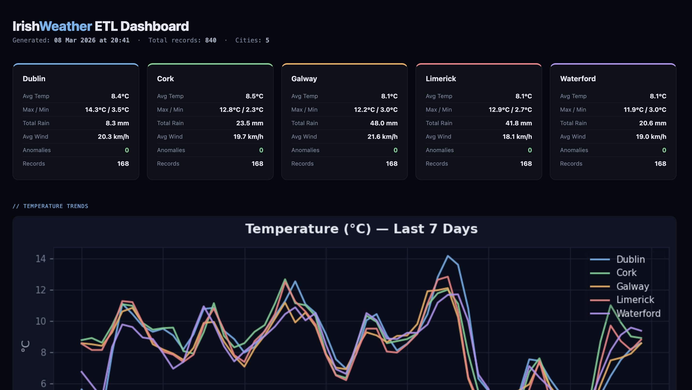

[README (2).md](https://github.com/user-attachments/files/25828022/README.2.md)
# 🔄 IrishWeather ETL Pipeline

A production-style ETL (Extract, Transform, Load) data pipeline that fetches live weather data for Irish cities, cleans and transforms it, stores it in a SQLite database, and visualises trends via an auto-generated HTML dashboard.

> **Tech Stack:** Python · Pandas · SQLite · Requests · Matplotlib · Schedule · Airflow-ready

---

## 📸 Demo



---

## 🎯 What This Project Demonstrates

| Skill | How It's Shown |
|-------|---------------|
| ETL Design | Modular extract → transform → load pipeline |
| Data Cleaning | Null handling, unit conversion, schema validation |
| SQL | Normalised schema, indexed queries, aggregations |
| Python | OOP design, error handling, logging |
| Scheduling | Cron-style job runner with `schedule` library |
| Visualisation | Auto-generated trend charts and HTML report |

---

## 📂 Project Structure

```
irishweather-etl/
├── pipeline/
│   ├── extract.py        # Fetches data from Open-Meteo API
│   ├── transform.py      # Cleans, validates, enriches data
│   ├── load.py           # Writes to SQLite with upsert logic
│   └── dashboard.py      # Generates HTML report with charts
├── db/
│   └── weather.db        # SQLite database (auto-created)
├── reports/
│   └── dashboard.html    # Auto-generated output
├── tests/
│   ├── test_extract.py
│   ├── test_transform.py
│   └── test_load.py
├── main.py               # Entry point + scheduler
├── config.py             # Cities, intervals, DB path
├── requirements.txt
└── README.md
```

---

## ⚙️ Setup & Run

```bash
# 1. Clone and install
git clone https://github.com/canutex7/irishweather-etl.git
cd irishweather-etl
pip install -r requirements.txt

# 2. Run the pipeline once
python main.py --run-once

# 3. Start the scheduler (runs every hour)
python main.py --schedule

# 4. View the dashboard
open reports/dashboard.html
```

---

## 🔍 Pipeline Walkthrough

### Extract
Calls the [Open-Meteo](https://open-meteo.com/) free API for 5 Irish cities:
- Dublin, Cork, Galway, Limerick, Waterford

```python
def extract_weather(city: str) -> dict:
    params = {
        "latitude": CITIES[city]["lat"],
        "longitude": CITIES[city]["lon"],
        "hourly": "temperature_2m,precipitation,windspeed_10m",
        "timezone": "Europe/Dublin"
    }
    response = requests.get(BASE_URL, params=params, timeout=10)
    response.raise_for_status()
    return response.json()
```

### Transform
- Converts Celsius → Fahrenheit (dual column)
- Flags anomalies (temperature > 35°C or < -10°C)
- Derives `feels_like` using windchill formula
- Validates required fields; drops malformed rows

```python
def transform(raw: dict) -> pd.DataFrame:
    df = pd.DataFrame(raw["hourly"])
    df["timestamp"] = pd.to_datetime(df["time"])
    df["temp_f"] = df["temperature_2m"] * 9/5 + 32
    df["is_anomaly"] = df["temperature_2m"].apply(
        lambda t: t > 35 or t < -10
    )
    df.dropna(subset=["temperature_2m", "windspeed_10m"], inplace=True)
    return df
```

### Load
Upserts into SQLite with conflict resolution on `(city, timestamp)`:

```sql
INSERT OR REPLACE INTO weather_readings
  (city, timestamp, temp_c, temp_f, precipitation, windspeed, is_anomaly)
VALUES (?, ?, ?, ?, ?, ?, ?);
```

### Dashboard
Generates a self-contained HTML file with embedded Matplotlib charts showing 7-day temperature trends per city.

---

## 📊 Database Schema

```sql
CREATE TABLE weather_readings (
    id          INTEGER PRIMARY KEY AUTOINCREMENT,
    city        TEXT NOT NULL,
    timestamp   TEXT NOT NULL,
    temp_c      REAL,
    temp_f      REAL,
    precipitation REAL,
    windspeed   REAL,
    is_anomaly  INTEGER DEFAULT 0,
    ingested_at TEXT DEFAULT CURRENT_TIMESTAMP,
    UNIQUE(city, timestamp)
);

CREATE INDEX idx_city_time ON weather_readings(city, timestamp);
```

---

## 🧪 Tests

```bash
pytest tests/ -v
```

Tests cover: API mock responses, transformation edge cases, DB write/read integrity.

---

## 🚀 Future Improvements
- [ ] Swap SQLite → PostgreSQL for production
- [ ] Add Apache Airflow DAG for orchestration
- [ ] Deploy dashboard to GitHub Pages via GitHub Actions
- [ ] Add Slack/email alerts for anomaly detection

---

## 📦 Requirements

```
requests==2.31.0
pandas==2.1.0
matplotlib==3.8.0
schedule==1.2.0
pytest==7.4.0
```

---

## 👨‍💻 Author

**Canute Fernandes** — [canutef7@gmail.com](mailto:canutef7@gmail.com) · [LinkedIn](https://linkedin.com/in/canutef)
